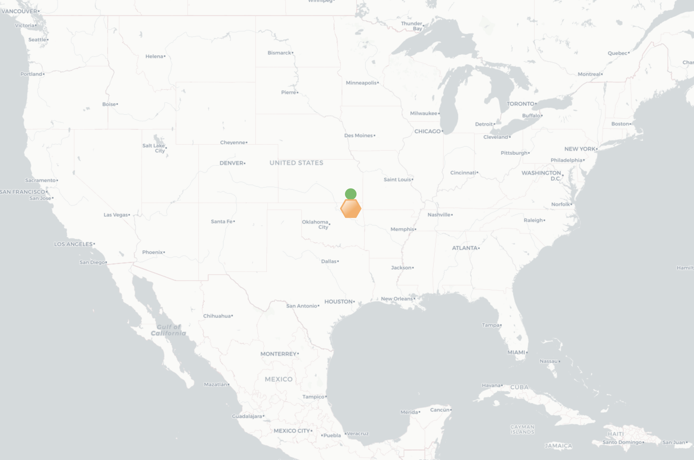

# showInfluenceOnMap  
This is an repo to show the researcher's global influence by plot some info on map.


[](https://github.com/ambv/black)

## Features  
### Add two marker to a list of countries:
One for number of unique researcher and one for number of unique institution. 
One result can be seen in 

## How to use?
### Clone the code
```bash
git clone https://github.com/liketheflower/showInfluenceOnMap.git
```

### Add src path to PYTHONPATH Modify the csv file and run the show citation code
- Add src path
```bash
export PYTHONPATH=path_to_src
```
- Run the code 
```bash
cd application/xiaoke_shen_citations
python show_my_citation.py
```

